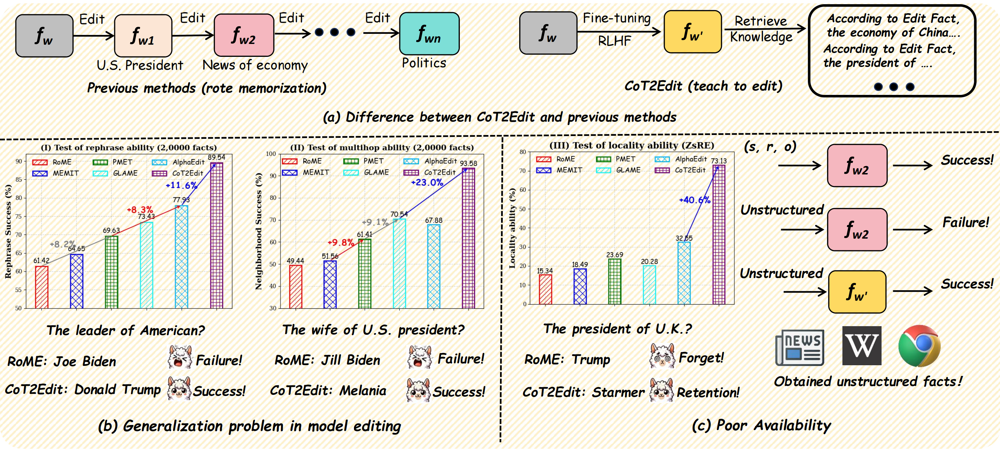
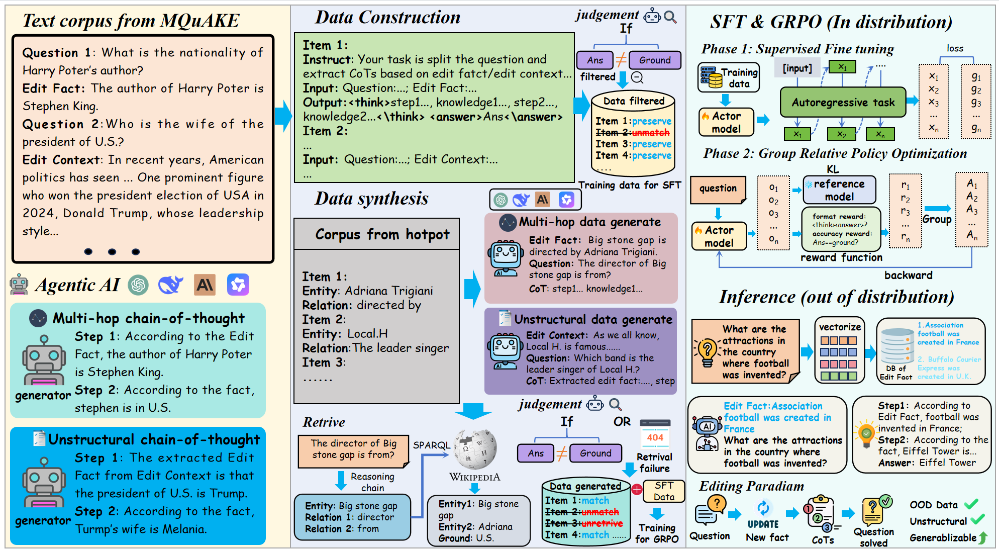
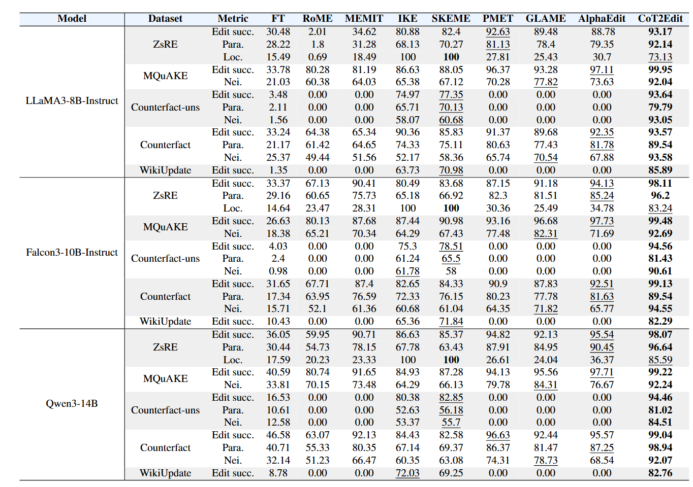

# code for CoT2Edit

## Learning to Edit Knowledge via Instruction-based Chain-of-Thought Prompting

### Overview

**CoT2Edit is a novel paradigm to leverage edit facts to solve practical tasks. It is the pioneer work to use CoTs in the domain of knowledge editing**.

- It opens up a whole new direction using chain-of-thought reasoning to help edit knowledge in LLMs.
- It is the first work incorporating GRPO training strategy to the domain of knowledge edit.
- It has the superior OOD ability, just take a single round of training, the editing methods can generalize six editing benchmarks.

## Introduction

Previous work like MEMIT and AlphaEdit have two main challenges: 

**Rote updating**: The editing methods directly inject new knowledge into LLM parameters, ignore there ability to use these facts, causing lower multihop and rephrase abilities.

**Poor availability**: (1) The form of editing facts are limited to triples of facts, which is not compatible in reality. (2) Parameter corruption causes a sharp decline in the general capabilities of LLMs. (3) Additionally, enterprise-level models must encapsulate all parameters after deployment and cannot be easily changed. The accumulation of these factors has made it impossible to implement the editing method.

## Framework
To solve this, CoT2Edit is proposed to (1) generate the instruction data to train the model learning the paradigm of editing.(2) SFT and GRPO are used to achieve this goal. (3) Through Chain-of-thought inference, the methods has superior generalizable ability in unseen benchmark just through one round of training. (4) The paradigm can be used to edit any form of knowledge.


(I) Construct editing instructions by prompting LLM agents to generate reasoning chains from editing corpora. (II) Generate more instruct data by LLM agents using entity relations from HotpotQA. (III) Train the model via SFT on Phase (I) data to learn targeted response patterns. (IV) Optimize the model using GRPO to enhance generalization on the combined (I)(II) data. (V) Deploy RAG to retrieve relevant edited facts during inference, ensuring accurate question answering.

## Experimental results of our CoT2Edit



(I) CoT2Edit achieves superior editing performance though the evaluate benchmark is the data in these evaluation sets had never been seen before.
(II) We are surprised to find that CoT2Edit is remarkably effective at integrating relevant knowledge, which significantly enhances its multi-hop reasoning capabilities.
(III) Compared to other editing methods, CoT2Edit preserves the vast majority of general capabilities, maintaining strong overall performance while enabling precise edits.

## Get Start

### Install environment
```
conda create -n CoT2Edit python=3.10
conda activate CoT2Edit
pip install -r ./requirements.txt
```
### Repository Structure

The `./data` directory contains all the prompts involved in generating datasets and editing chains of thought for CoT2Edit, evaluating datasets are also put in this.

The `./train_sft` directory contains the code for sft phase of training.

The `./train_grpo` directory contains the code for grop training.

The `./inference` directory includes the code for evaluating CoT2Edit.

### Dataset Generation

Run the following command for sft cot data generation:
```
python data_cons.py
python data_cons_uns.py
```
Run the following command for grpo instruction data generation:
```
python data_cons_chat.py
python data_cons_chat_v1.py
```
Note: You should use your openai, deepseek or qwen api key to run the above command to generate your own data. You can also use the dataset directly in the `./data` directory, and pass this step.

### Training editing paradigm
Run the following command:
```
bash ./train_sft/train.sh
```
Using the sft trained model to run the following command:
```
bash ./train_grpo/run_grpo_model.sh
```

### Evaluation

Run the following command:
```
cd ./inference
python eval_dataset.py
```

